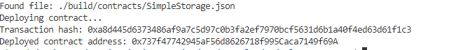

# 1. Screenshot of the console output immediately after you have successfully deployed a smart contract

# 2. Transaction hash from the contract deployment 
 0xa8d445d6373486af9a7c5d97c0b3fa2ef7970bcf5631d6b1a40f4ed63d61f1c3

# 3. Deployed contract address from the contract deployment 
0x737f47742945aF56d8626718f995Caca7149f69A