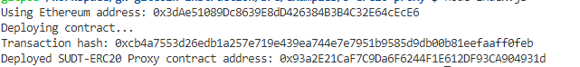
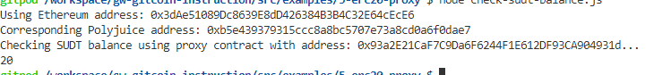

## Task 5 Deploy The ERC20 Proxy Contract For The Deposited SUDT

1.


2.The address of the ERC20 Proxy Contract you deployed .
```sh
0x93a2E21CaF7C9Da6F6244F1E612DF93CA904931d
```

3.A screenshot of the console output immediately after checking your SUDT balance.


4.The Ethereum address that was checked 
```sh
0x3dAe51089Dc8639E8dD426384B3B4C32E64cEcE6
```