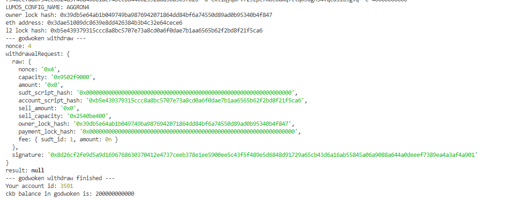

## 1. A screenshot of the console output immediately after running the withdraw command.

## 2. The Ethereum address that you've used for your Layer 2 account (in text format).
    0x3dae51089dc8639e8dd426384b3b4c32e64cece6

## 3. The Nervos Layer 1 address that you passed to withdraw command (in text format).
ckt1qyqdrv729zpc7m8c0awqfctqm9dgn34vqedsl69gvq