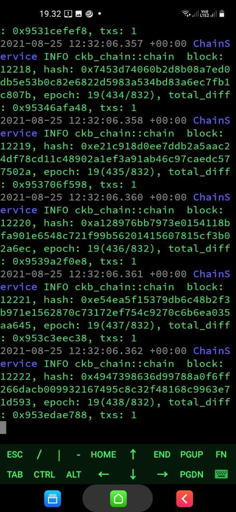
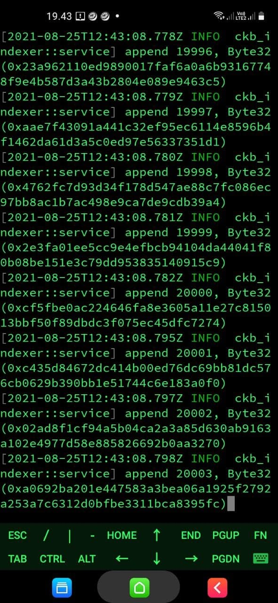

# Gitcoin: 0) Setup A Local CKB Node And CKB Indexer For The Testnet

## CKB Node

A screenshot of the console output from your local Testnet CKB Node after it has fully synchronized with the network.

## CKB Indexer

A screenshot of the console output from your local CKB Indexer after it has fully synchronized with the local Testnet CKB Node.

