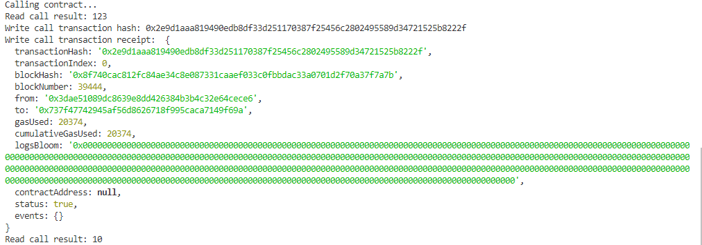

# NervosHackathon_3

## 1.smart contract call.



## 2. The transaction hash 

   <b>0x2e9d1aaa819490edb8df33d251170387f25456c2802495589d34721525b8222f</b> <br><br>   

## 3. The contract address that you called .

    0x737f47742945aF56d8626718f995Caca7149f69A

## 4. The ABI for contract you made a call on .

```
[
  {
    "inputs": [],
    "stateMutability": "payable",
    "type": "constructor"
  },
  {
    "inputs": [
      {
        "internalType": "uint256",
        "name": "x",
        "type": "uint256"
      }
    ],
    "name": "set",
    "outputs": [],
    "stateMutability": "payable",
    "type": "function"
  },
  {
    "inputs": [],
    "name": "get",
    "outputs": [
      {
        "internalType": "uint256",
        "name": "",
        "type": "uint256"
      }
    ],
    "stateMutability": "view",
    "type": "function"
  }
]
```