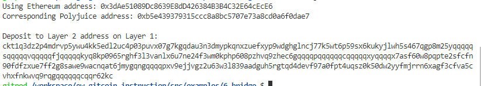

## Task 6 Use Force Bridge To Deposit Tokens From Ethereum To Polyjuice

1.A screenshot of the console output immediately after you have successfully generated your Deposit Receiver Address.


2.Your Deposit Receiver Address (in text format).
```sh
ckt1q3dz2p4mdrvp5ywu4kk5edl2uc4p03puvx07g7kgqdau3n3dmypkqnxzuefxyp9wdghglncj77k5wt6p59sx6kukyjlwh5s467qgp8m25yqqqqqsqqqqqvqqqqqfjqqqqqkyq8kp0965rghf3l3vanlx6u7ne24f3wm0kphp608pzhvq9zhec6gqqqqpqqqqqqcqqqqqxyqqqqx7asf60w8pqpte2sfcfn90fdfzxue7ff2g8sawe9wacnqat6jmygqngqqqqpxv9ejjvgz2u63w3l839aadguh5rgtqd4devf97a0fpt4uqsz0k50dw2yyfmjrrn6xagf3cfva5cvhxfnkwvq9rqgqqqqqqcqqr62kc
```

3.The Ethereum address used to generate the Deposit Receiver Address (in text format).
```sh
0x3dAe51089Dc8639E8dD426384B3B4C32E64cEcE6
```

